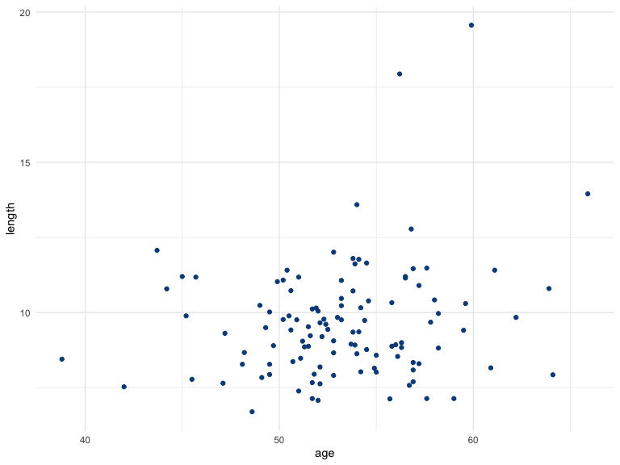
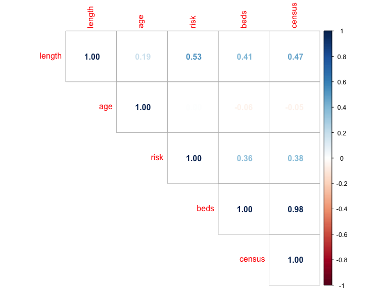

201A Analysis Project
================

### 201A Analysis Project

### Julián Ponce

``` r
senic_data =
  read_csv (file = "./data/SENIC.csv")%>%
janitor::clean_names()
```

    ## Parsed with column specification:
    ## cols(
    ##   id = col_double(),
    ##   length = col_double(),
    ##   age = col_double(),
    ##   risk = col_double(),
    ##   culture = col_double(),
    ##   xray = col_double(),
    ##   beds = col_double(),
    ##   msch = col_double(),
    ##   region = col_double(),
    ##   census = col_double(),
    ##   nurses = col_double(),
    ##   svcs = col_double()
    ## )

``` r
skimr::skim(senic_data)
```

|                                                  |             |
| :----------------------------------------------- | :---------- |
| Name                                             | senic\_data |
| Number of rows                                   | 113         |
| Number of columns                                | 12          |
| \_\_\_\_\_\_\_\_\_\_\_\_\_\_\_\_\_\_\_\_\_\_\_   |             |
| Column type frequency:                           |             |
| numeric                                          | 12          |
| \_\_\_\_\_\_\_\_\_\_\_\_\_\_\_\_\_\_\_\_\_\_\_\_ |             |
| Group variables                                  | None        |

Data summary

**Variable type: numeric**

| skim\_variable | n\_missing | complete\_rate |   mean |     sd |   p0 |    p25 |    p50 |    p75 |   p100 | hist  |
| :------------- | ---------: | -------------: | -----: | -----: | ---: | -----: | -----: | -----: | -----: | :---- |
| id             |          0 |              1 |  57.00 |  32.76 |  1.0 |  29.00 |  57.00 |  85.00 | 113.00 | ▇▇▇▇▇ |
| length         |          0 |              1 |   9.65 |   1.91 |  6.7 |   8.34 |   9.42 |  10.47 |  19.56 | ▇▇▁▁▁ |
| age            |          0 |              1 |  53.23 |   4.46 | 38.8 |  50.90 |  53.20 |  56.20 |  65.90 | ▁▂▇▃▁ |
| risk           |          0 |              1 |   4.35 |   1.34 |  1.3 |   3.70 |   4.40 |   5.20 |   7.80 | ▂▃▇▃▁ |
| culture        |          0 |              1 |  15.79 |  10.23 |  1.6 |   8.40 |  14.10 |  20.30 |  60.50 | ▇▆▂▁▁ |
| xray           |          0 |              1 |  81.63 |  19.36 | 39.6 |  69.50 |  82.30 |  94.10 | 133.50 | ▃▅▇▃▁ |
| beds           |          0 |              1 | 252.17 | 192.84 | 29.0 | 106.00 | 186.00 | 312.00 | 835.00 | ▇▅▂▁▁ |
| msch           |          0 |              1 |   1.85 |   0.36 |  1.0 |   2.00 |   2.00 |   2.00 |   2.00 | ▂▁▁▁▇ |
| region         |          0 |              1 |   2.36 |   1.01 |  1.0 |   2.00 |   2.00 |   3.00 |   4.00 | ▆▇▁▇▃ |
| census         |          0 |              1 | 191.37 | 153.76 | 20.0 |  68.00 | 143.00 | 252.00 | 791.00 | ▇▃▂▁▁ |
| nurses         |          0 |              1 | 173.25 | 139.27 | 14.0 |  66.00 | 132.00 | 218.00 | 656.00 | ▇▅▂▁▁ |
| svcs           |          0 |              1 |  43.16 |  15.20 |  5.7 |  31.40 |  42.90 |  54.30 |  80.00 | ▁▆▇▆▂ |

``` r
senic_data =
  senic_data %>%
  #c is to include only these while -c is remove these
  subset(select = c(id, length, age,risk, beds,region,census ))
#exclude data for culture, xrays, msch, nurses, and svcs 
```

``` r
sapply(senic_data, class)
```

    ##        id    length       age      risk      beds    region    census 
    ## "numeric" "numeric" "numeric" "numeric" "numeric" "numeric" "numeric"

Create a new chunk comman +opton+i Change region from numeric to factor

``` r
senic_data = senic_data%>%
  mutate(region = as.factor(region), 
        id = as.factor(id),
        age = as.numeric(age),
        length=as.numeric(length))%>%
  mutate(risk=(risk*.100))
  
senic_data1 =
  senic_data %>%
  #c is to include only these while -c is remove these
  subset(select = c(length, age,risk, beds,census   ))
#exclude data for culture, xrays, msch, nurses, and svcs 
```

\#1\_Univariate Histograms in case needed but i think SKIMR IS okay

``` r
histogram_age =
ggplot(senic_data, aes(x = age)) + 
  geom_histogram(bins =11, color="darkblue", fill="lightblue") + labs (title = "Figure 1.Age Distribution", x="Age", y ="Count") 

histogram_length=
ggplot(senic_data, aes(x = length)) + 
   geom_histogram(bins =11, color="darkblue", fill="lightblue") + labs (title = "Figure 2.Length of Stay Distribution", x="Length of Stay(Days)", y ="Count") 

histogram_risk =
ggplot(senic_data, aes(x = risk)) + 
   geom_histogram(bins =11, color="darkblue", fill="lightblue") + labs (title = "Figure 3.Infection Distribution", x="Infection Risk(Years)", y ="Count") 

histogram_beds =
ggplot(senic_data, aes(x = beds)) + 
   geom_histogram(bins =11, color="darkblue", fill="lightblue") + labs (title = "Figure 4. Bed Distribution", x="Number of Beds", y ="Count") 

histogram_census =
ggplot(senic_data, aes(x = census)) + 
     geom_histogram(bins =11, color="darkblue", fill="lightblue") + labs (title = "Figure 5.Census Distribution", x="Average Number of Hospital Patients Per Day", y ="Count") 

histogram_age+histogram_length
```


``` r
histogram_risk+histogram_beds+histogram_census
```


\#2\_Correlations
-<https://statsandr.com/blog/correlation-coefficient-and-correlation-test-in-r/>

``` r
cor.test(senic_data$age, senic_data$length, method="pearson")
```

    ## 
    ##  Pearson's product-moment correlation
    ## 
    ## data:  senic_data$age and senic_data$length
    ## t = 2.0268, df = 111, p-value = 0.04508
    ## alternative hypothesis: true correlation is not equal to 0
    ## 95 percent confidence interval:
    ##  0.004335447 0.361044064
    ## sample estimates:
    ##      cor 
    ## 0.188914

``` r
cor.test(senic_data$age, senic_data$risk, method="pearson")
```

    ## 
    ##  Pearson's product-moment correlation
    ## 
    ## data:  senic_data$age and senic_data$risk
    ## t = 0.011517, df = 111, p-value = 0.9908
    ## alternative hypothesis: true correlation is not equal to 0
    ## 95 percent confidence interval:
    ##  -0.1836737  0.1857855
    ## sample estimates:
    ##         cor 
    ## 0.001093166

``` r
ggplot(senic_data) +
  aes(x = age, y = length) +
  geom_point(colour = "#0c4c8a") +
  theme_minimal()
```



``` r
#corr matrix, run corrplot lib 

corrplot(cor(senic_data1),
  method = "number",
  type = "upper" # show only upper side
)
```



``` r
one.way <- aov(length ~ region, data = senic_data)

summary(one.way)
```

    ##              Df Sum Sq Mean Sq F value   Pr(>F)    
    ## region        3  103.5   34.52   12.31 5.38e-07 ***
    ## Residuals   109  305.7    2.80                     
    ## ---
    ## Signif. codes:  0 '***' 0.001 '**' 0.01 '*' 0.05 '.' 0.1 ' ' 1

## Regression \#3

``` r
linearmod = lm(length ~ age + beds + census + risk , data=senic_data)  # build linear regression model on full data

linearmod %>%  
    broom::tidy()%>% 
knitr::kable(digits=3)
```

| term        | estimate | std.error | statistic | p.value |
| :---------- | -------: | --------: | --------: | ------: |
| (Intercept) |    2.097 |     1.659 |     1.264 |   0.209 |
| age         |    0.086 |     0.030 |     2.871 |   0.005 |
| beds        |  \-0.013 |     0.004 |   \-3.617 |   0.000 |
| census      |    0.020 |     0.005 |     4.445 |   0.000 |
| risk        |    5.497 |     1.078 |     5.101 |   0.000 |
